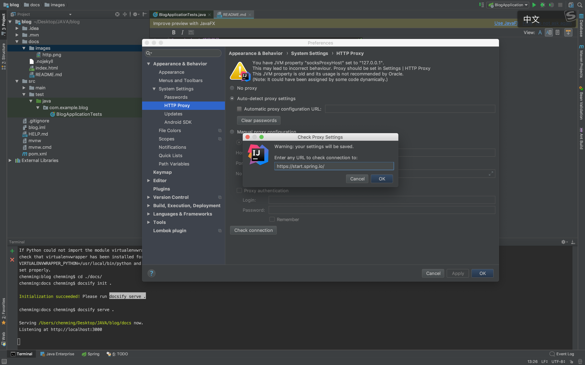

# springboot 项目学习

> 构建一个springboot的项目

## 项目构建

 new project -> 
 
 如果无法加载依赖，在设置中
  
 File>Settings>HTTP Proxy>Manual proxy configuration
 
    https://start.spring.io/





## 数据库设计

### 表设计原则

    1. key 加快where搜索的速度
    2. primary key 约束作用  自动定义的 UNIQUE 约束
    3. unique key 主要是用来防止数据插入的时候重复的。

### 表结构

```sql
-- 类目
create table `product_category` (
    `category_id` int not null auto_increment,
    `category_name` varchar(64) not null comment '类目名字',
    `category_type` int not null comment '类目编号',
    `create_time` timestamp not null default current_timestamp comment '创建时间',
    `update_time` timestamp not null default current_timestamp on update current_timestamp comment '修改时间',
    primary key (`category_id`)
    unique key `uqe_category_type` (category_type)
);

-- 商品
create table `product_info` (
    `product_id` varchar(32) not null,
    `product_name` varchar(64) not null comment '商品名称',
    `product_price` decimal(8,2) not null comment '单价',
    `product_stock` int not null comment '库存',
    `product_description` varchar(64) comment '描述',
    `product_icon` varchar(512) comment '小图',
    `product_status` tinyint(3) DEFAULT '0' COMMENT '商品状态,0正常1下架',
    `category_type` int not null comment '类目编号',
    `create_time` timestamp not null default current_timestamp comment '创建时间',
    `update_time` timestamp not null default current_timestamp on update current_timestamp comment '修改时间',
    primary key (`product_id`)
);

-- 订单
create table `order_master` (
    `order_id` varchar(32) not null,
    `buyer_name` varchar(32) not null comment '买家名字',
    `buyer_phone` varchar(32) not null comment '买家电话',
    `buyer_address` varchar(128) not null comment '买家地址',
    `buyer_openid` varchar(64) not null comment '买家微信openid',
    `order_amount` decimal(8,2) not null comment '订单总金额',
    `order_status` tinyint(3) not null default '0' comment '订单状态, 默认为新下单',
    `pay_status` tinyint(3) not null default '0' comment '支付状态, 默认未支付',
    `create_time` timestamp not null default current_timestamp comment '创建时间',
    `update_time` timestamp not null default current_timestamp on update current_timestamp comment '修改时间',
    primary key (`order_id`),
    key `idx_buyer_openid` (`buyer_openid`)
);

-- 订单商品
create table `order_detail` (
    `detail_id` varchar(32) not null,
    `order_id` varchar(32) not null,
    `product_id` varchar(32) not null,
    `product_name` varchar(64) not null comment '商品名称',
    `product_price` decimal(8,2) not null comment '当前价格,单位分',
    `product_quantity` int not null comment '数量',
    `product_icon` varchar(512) comment '小图',
    `create_time` timestamp not null default current_timestamp comment '创建时间',
    `update_time` timestamp not null default current_timestamp on update current_timestamp comment '修改时间',
    primary key (`detail_id`),
    key `idx_order_id` (`order_id`)
);

-- 卖家(登录后台使用, 卖家登录之后可能直接采用微信扫码登录，不使用账号密码)
create table `seller_info` (
    `id` varchar(32) not null,
    `username` varchar(32) not null,
    `password` varchar(32) not null,
    `openid` varchar(64) not null comment '微信openid',
    `create_time` timestamp not null default current_timestamp comment '创建时间',
    `update_time` timestamp not null default current_timestamp on update current_timestamp comment '修改时间',
    primary key (`id`)
) comment '卖家信息表';

```

## lombok

    Annotation Processors
    右侧勾选Enable annotation processing即可。

```xml
 <dependency>
      <groupId>org.projectlombok</groupId>
      <artifactId>lombok</artifactId>
 </dependency>
```

## 日志选择

### 日志门面

>SLF4J

    import org.slf4j.Logger;
    
    
    @Slf4j
    
    private final Logger logger = LoggerFactory.getLogger(LoggerTest.class);
    
    log.debug("debug test");
    log.info("info test");
    log.warn("warn test");
    log.error("error test");
#### 配置

    需求：
     1.每天一个文件
     2.不同类型输出不同文件
     
     spring 1.*
     com.mysql.jdbc.Driver
     spring 2.*
     com.mysql.cj.jdbc.Driver
     
     

### 日志实现

>Logback


## 代码实现

### 数据访问组件 repository

    1. 继承 JpaRepository
    2. 定义 对应表 数据对象
    
### 服务实现类 server

    1. 定义服务类的接口类
    2. 定义服务的实现类
    2.1 服务实现类 使用 注解 @Service
    
### 控制器 controller

    1. 类使用注解 
        #定义接口类型
        @RestController
        #定义接口的前缀
        @RequestMapping("/seller/product")
    2.函数使用的注解
    
        #定义接口的url
        @GetMapping 。。。
        #接口数据验证的注解
        @Valid ProductForm form,BindingResult bindingResult,Map<String, Object> map）
        
    3.定义接口响应类
    
        定义每一层的数据结构体 然后进行拼接
        

## 注解使用

### @DynamicUpdate

    时间自动更新
    
### @Data

    自动设置set get toString
    
### @Transactional
    
    测试中的数据见那个会被回滚 不会加到数据库中
    
### @Slf4j
    自动加载日志门面

    private final Logger logger = LoggerFactory.getLogger(LoggerTest2.class);
    
### @Service

    服务实现类

## 卖家端开发

### DAO 设计和开发

## 卖家端开发

### 添加商品

### 定义表单的验证类


